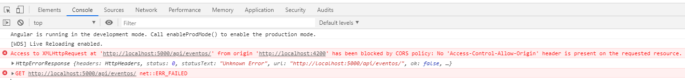
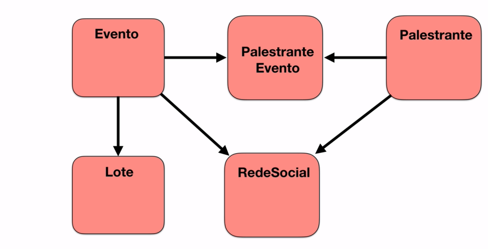
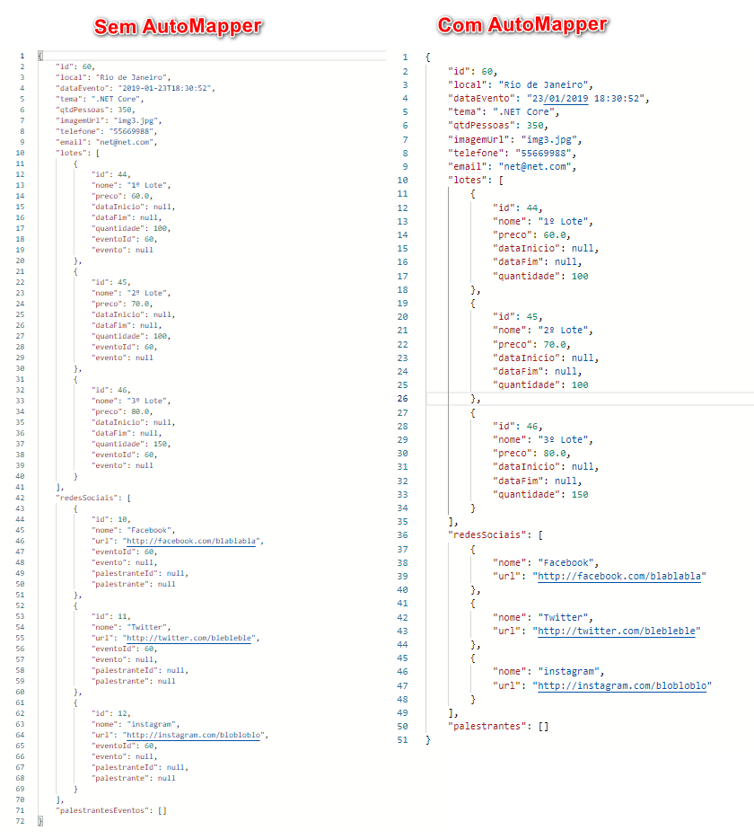

# ProAgil

###

## Requests HTTP no Angular

Em **_app.modules.ts_** importe o **HttpClientModule**

`import { HttpClientModule } from '@angular/common/http';`

O arquivo **_eventos.component.ts_** ficará da seguinte forma:

```ts
export class EventosComponent implements OnInit {

  eventos: any = [];

  url = 'http://localhost:5000/api/eventos/';

  constructor(private http: HttpClient) { }

  ngOnInit(): void {
    this.getEventos();
  }

  getEventos(): void {
    this.http.get(this.url).subscribe(
      response => {
        this.eventos = response;
      },
      error => {
        console.log(error);
      });
  }
```
É esperado o erro abaixo:



Para ajustar entre  no arquivo **Setup.cs** que está na pasta **ProAgil.API** e use o _Cors_

```c#
public void ConfigureServices (IServiceCollection services)
{
    services.AddDbContext<DataContext> (x => x.UseSqlite (Configuration.GetConnectionString ("DefaultConnection")));
    services.AddCors ();
    services.AddControllers ();
}

public void Configure (IApplicationBuilder app, IWebHostEnvironment env)
{
    if (env.IsDevelopment ())
    {
        app.UseDeveloperExceptionPage ();
    }

    app.UseCors (x =>
        x.AllowAnyOrigin () // permito toda origem
       .AllowAnyMethod () // permito todos os metodos
        .AllowAnyHeader () // permito todos cabeçalho
        );

    app.UseRouting ();
    app.UseAuthorization ();

    app.UseEndpoints (endpoints =>
    {
        endpoints.MapControllers ();
    });
}
```

## Entidades


## AutoMapper


#

